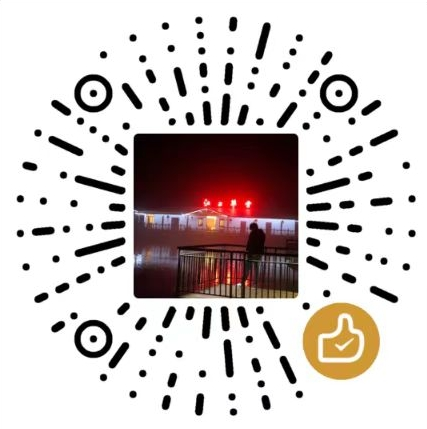
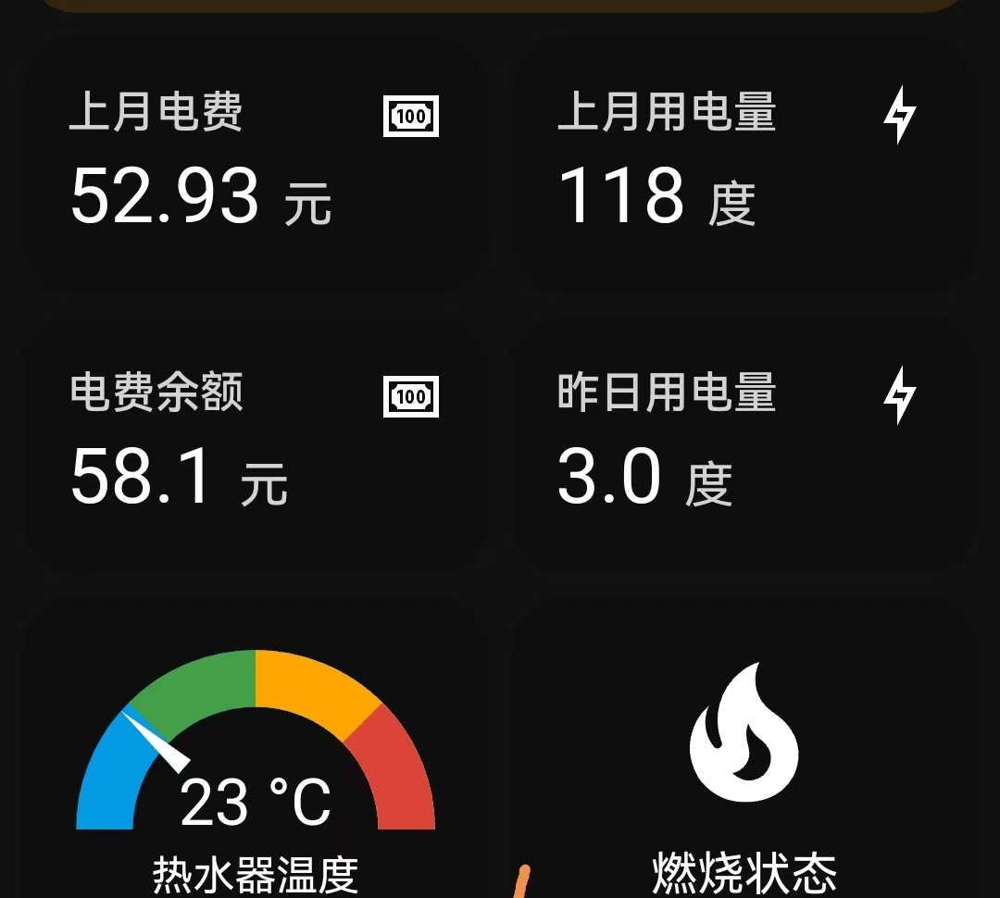
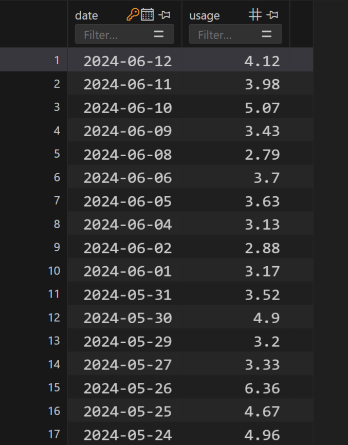
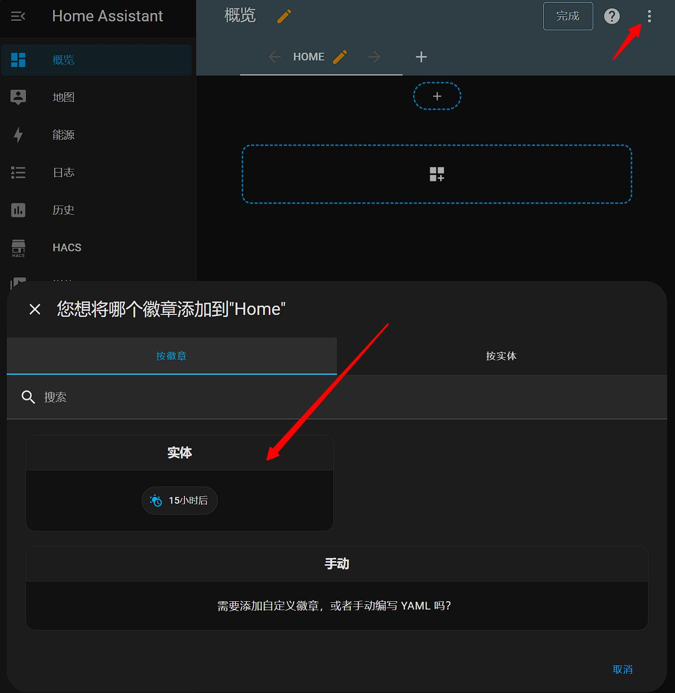
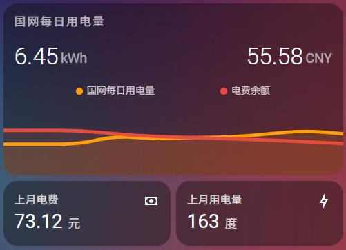

**重要说明：**原作者@renhai-lab 已于2023年10将项目归档，原仓库不再更新。这个版本是在原仓库基础上大幅改动，在此向原作者表达谢意和致敬。验证码识别已经从最开始的在线商业API替换成离线神经网络检测版本，请使用本仓库的同学点个小星星，或者打赏鼓励。

添加微信通知后，我想这基本上就是这个插件的最终形态了，docker镜像压缩到300MB，后续可能只会在网站变动或者出问题才会更新，再次感谢大家的Star。

**注意** 有很多新手都在提交验证码不能识别的相关issue，特在此统一说明：国网每天有登录限制，每天只能登录有限的几次，超过限制验证码识别成功也不会登录成功。因此，诸如[issue47](https://github.com/ARC-MX/sgcc_electricity_new/issues/47),[issue50](https://github.com/ARC-MX/sgcc_electricity_new/issues/50),[issue29](https://github.com/ARC-MX/sgcc_electricity_new/issues/29)这些都是这个问题，以后就不做回复了。

### 入群方式

最近issue太多实在是回复不过来了，特此添加QQ交流群
通过为项目点star并微信打赏备注QQ名或QQ号等信息，入群会审核这些信息
[关于创建QQ付费群的说明](https://github.com/ARC-MX/sgcc_electricity_new/issues/78)

### 支付宝&微信 打赏码

<p align="center">



</p>

# ⚡️国家电网电力获取

[](https://github.com/ARC-MX/sgcc_electricity_new/actions/workflows/docker-image.yml)
[](https://hub.docker.com/r/arcw/sgcc_electricity)
[](https://hub.docker.com/r/arcw/sgcc_electricity)

<p align="center">


</p>

## 简介

本应用可以帮助你将国网的电费、用电量数据接入homeassistant，实现实时追踪家庭用电量情况；并且可以将每日用电量保存到数据库，历史有迹可循。具体提供两类数据：

1. 在homeassistant以实体显示：

   | 实体entity_id                          | 说明                                               |
   | -------------------------------------- | -------------------------------------------------- |
   | sensor.last_electricity_usage_xxxx     | 最近一天用电量，单位KWH、度。                      |
   | sensor.electricity_charge_balance_xxxx | 预付费显示电费余额，反之显示上月应交电费，单位元。 |
   | sensor.yearly_electricity_usage_xxxx   | 今年总用电量，单位KWH、度。                        |
   | sensor.yearly_electricity_charge_xxxx  | 今年总用电费，单位元。                             |
   | sensor.month_electricity_usage_xxxx    | 最近一个月用电量，单位KWH、度。                    |
   | sensor.month_electricity_charge_xxxx   | 上月总用电费，单位元。                             |
2. 可选，近三十天每日用电量数据（SQLite数据库）
   数据库表名为 daily+userid ，在项目路径下有个homeassistant.db  的数据库文件就是；
   如需查询可以用

   ```
   "SELECT * FROM dailyxxxxxxxx;"
   ```

   得到如下结果：



## 适用范围

1. 适用于除南方电网覆盖省份外的用户。即除广东、广西、云南、贵州、海南等省份的用户外，均可使用本应用获取电力、电费数据。
2. 不管是通过哪种哪种安装的homeassistant，只要可以运行python，有约1G硬盘空间和500M运行内存，都可以采用本仓库部署。

本镜像支持架构：

> - `linux/amd64`：适用于 x86-64（amd64）架构的 Linux 系统，例如windows电脑。
> - `linux/arm64`：适用于 ARMv8 架构的 Linux 系统，例如树莓派3+，N1盒子等。
> - `linux/armv7`，暂不提供 ARMv7 架构的 Linux 系统，例如树莓派2，玩客云等，主要原因是onnx-runtime没有armv7版本的库，用户可以参考 [https://github.com/nknytk/built-onnxruntime-for-raspberrypi-linux.git](https://github.com/nknytk/built-onnxruntime-for-raspberrypi-linux.git)自行安装库然后编译docker镜像。

## 实现流程

通过python的selenium包获取国家电网的数据，通过homeassistant的提供的[REST API](https://developers.home-assistant.io/docs/api/rest/)将采用POST请求将实体状态更新到homeassistant。

国家电网添加了滑动验证码登录验证，我这边最早采取了调用商业API的方式，现在已经更新成了离线方案。利用Yolov3神经网络识别验证码，请大家放心使用。

# 安装与部署

## 🆕 方式一：GitHub Actions云端部署（推荐，完全免费）

**特点：**
- ✅ **完全免费** - 利用GitHub Actions每月2000分钟免费额度
- ✅ **无需本地服务器** - 云端自动运行，不占用本地资源
- ✅ **自动更新** - 每天定时自动获取数据
- ✅ **简单易用** - 5分钟完成配置

**适用场景：** 如果您只需要在Home Assistant中显示电费数据，不需要数据库存储每日详细数据。

### 📖 快速开始

👉 **查看详细教程：[GitHub Actions快速部署指南](QUICK_START_GITHUB.md)**

**简要步骤：**
1. Fork本仓库到您的GitHub账号
2. 配置GitHub Secrets（国网账号密码）
3. 启用GitHub Actions
4. 配置本地Home Assistant读取GitHub数据

**数据流程：**
```
GitHub Actions(云端) → 获取电费数据 → 保存到GitHub仓库 → 本地Home Assistant读取
```

---

## 方式二：本地Docker部署（功能完整）

**特点：**
- ✅ 支持数据库存储历史数据
- ✅ 支持余额不足通知
- ✅ 完全本地运行

**适用场景：** 需要完整功能，包括SQLite数据库存储每日用电量详细数据。

### 1）注册国家电网账户

首先要注册国家电网账户，绑定电表，并且可以手动查询电量

注册网址：[https://www.95598.cn/osgweb/login](https://www.95598.cn/osgweb/login)

### 2）获取HA token

  token获取方法参考[https://blog.csdn.net/qq_25886111/article/details/106282492](https://blog.csdn.net/qq_25886111/article/details/106282492)

### 3）docker镜像部署，速度快

1. 安装docker和homeassistant，[Homeassistant极简安装法](https://github.com/renhaiidea/easy-homeassistant)。
2. 克隆仓库

```bash
git clone https://github.com/ARC-MX/sgcc_electricity_new.git
# 如果github网络环境不好的话可以使用国内镜像，完全同步的，个人推荐使用国内镜像
# git clone https://gitee.com/ARC-MX/sgcc_electricity_new.git
cd sgcc_electricity_new
```

3. 创建环境变量文件

```bash
cp example.env .env
vim .env           # 参考以下文件编写.env文件
```

```bash
### 以下项都需要修改
## 国网登录信息
# 修改为自己的登录账号
PHONE_NUMBER="xxx" 
# 修改为自己的登录密码
PASSWORD="xxxx" 
# 排除指定用户ID，如果出现一些不想检测的ID或者有些充电、发电帐号、可以使用这个环境变量，如果有多个就用","分隔，","之间不要有空格
IGNORE_USER_ID=xxxxxxx,xxxxxxx,xxxxxxx

# SQLite 数据库配置
# or False 不启用数据库储存每日用电量数据。
ENABLE_DATABASE_STORAGE=True
# 数据库名，默认为homeassistant
DB_NAME="homeassistant.db"
# COLLECTION_NAME默认为electricity_daily_usage_{国网用户id}，不支持修改。

## homeassistant配置
# 改为你的localhost为你的homeassistant地址
HASS_URL="http://localhost:8123/" 
# homeassistant的长期令牌
HASS_TOKEN="eyxxxxx"

## selenium运行参数
# 任务开始时间，24小时制，例如"07:00”则为每天早上7点执行，第一次启动程序如果时间晚于早上7点则会立即执行一次，每隔12小时执行一次。
JOB_START_TIME="07:00"
# 每次操作等待时间，推荐设定范围为[2,30]，该值表示每次点击网页后所要等待数据加载的时间，如果出现“no such element”诸如此类的错误可适当调大该值，如果硬件性能较好可以适当调小该值
RETRY_WAIT_TIME_OFFSET_UNIT=15


## 记录的天数, 仅支持填写 7 或 30
# 国网原本可以记录 30 天,现在不开通智能缴费只能查询 7 天造成错误
DATA_RETENTION_DAYS=7

## 余额提醒
# 是否缴费提醒
RECHARGE_NOTIFY=Flase
# 余额
BALANCE=5.0
# pushplus token 如果有多个就用","分隔，","之间不要有空格，单个就不要有","
PUSHPLUS_TOKEN=xxxxxxx,xxxxxxx,xxxxxxx
```

4. 运行

  我已经优化了镜像环境，将镜像的地址配置为阿里云，如果要使用docker hub的源可以将docker-compose.yml中
  image: registry.cn-hangzhou.aliyuncs.com/arcw/sgcc_electricity:latest 改为 arcw/sgcc_electricity:latest

```bash
运行获取传感器名称
docker-compose up -d
docker-compose logs sgcc_electricity_app
```

运行成功应该显示如下日志：

```bash
2024-06-06 16:00:43  [INFO    ] ---- 程序开始，当前仓库版本为1.x.x，仓库地址为https://github.com/ARC-MX/sgcc_electricity_new.git
2024-06-06 16:00:43  [INFO    ] ---- enable_database_storage为false，不会储存到数据库
2024-06-06 16:00:43  [INFO    ] ---- 当前登录的用户名为: xxxxxx，homeassistant地址为http://192.168.1.xx:8123/,程序将在每天00:00执行
2024-06-06 16:00:43  [INFO    ] ---- 此次为首次运行，等待时间(FIRST_SLEEP_TIME)为10秒，可在.env中设置
2024-06-06 16:00:59  [INFO    ] ---- Webdriver initialized.
2024-06-06 16:01:20  [INFO    ] ---- Click login button.
2024-06-06 16:01:20  [INFO    ] ---- Get electricity canvas image successfully.
2024-06-06 16:01:20  [INFO    ] ---- Image CaptCHA distance is xxx.
2024-06-06 16:01:25  [INFO    ] ---- Login successfully on https://www.95598.cn/osgweb/login
2024-06-06 16:01:33  [INFO    ] ---- 将获取1户数据，user_id: ['xxxxxxx']
2024-06-06 16:01:42  [INFO    ] ---- Get electricity charge balance for xxxxxxx successfully, balance is xxx CNY.
2024-06-06 16:01:51  [INFO    ] ---- Get year power usage for xxxxxxx successfully, usage is xxx kwh
2024-06-06 16:01:51  [INFO    ] ---- Get year power charge for xxxxxxx successfully, yealrly charge is xxx CNY
2024-06-06 16:01:55  [INFO    ] ---- Get month power charge for xxxxxxx successfully, 01 月 usage is xxx KWh, charge is xxx CNY.
2024-06-06 16:01:55  [INFO    ] ---- Get month power charge for xxxxxxx successfully, 02 月 usage is xxx KWh, charge is xxx CNY.
2024-06-06 16:01:55  [INFO    ] ---- Get month power charge for xxxxxxx successfully, 2024-03-01-2024-03-31 usage is xxx KWh, charge is xxx CNY.
2024-06-06 16:01:55  [INFO    ] ---- Get month power charge for xxxxxxx successfully, 2024-04-01-2024-04-30 usage is xxx KWh, charge is xxx CNY.
2024-06-06 16:01:59  [INFO    ] ---- Get daily power consumption for xxxxxxx successfully, , 2024-06-05 usage is xxx kwh.
........
2024-12-25 13:43:25  [INFO    ] ---- Check the electricity bill balance. When the balance is less than 100.0 CNY, the notification will be sent = True
2024-12-25 13:43:25  [INFO    ] ---- Homeassistant sensor sensor.electricity_charge_balance_xxxx state updated: 102.3 CNY
2024-12-25 13:43:25  [INFO    ] ---- Homeassistant sensor sensor.last_electricity_usage_xxxx state updated: 6.56 kWh
2024-12-25 13:43:25  [INFO    ] ---- Homeassistant sensor sensor.yearly_electricity_usage_xxxx state updated: 1691 kWh
2024-12-25 13:43:25  [INFO    ] ---- Homeassistant sensor sensor.yearly_electricity_charge_xxxx state updated: 758.57 CNY
2024-12-25 13:43:25  [INFO    ] ---- Homeassistant sensor sensor.month_electricity_usage_xxxx state updated: 169 kWh
2024-12-25 13:43:25  [INFO    ] ---- Homeassistant sensor sensor.month_electricity_charge_xxxx state updated: 75.81 CNY
2024-12-25 13:43:25  [INFO    ] ---- User xxxxxxx state-refresh task run successfully!
```

**sensor.electricity_charge_balance_xxxx 为余额传感器**

5. 配置configuration.yaml文件, 将下面中的_xxxx 替换为自己log中的_xxxx后缀。
6. 由于是API方式传递传感器数据，所以要想重启ha实体ID可用，必须配置如下

```yaml
template:
  - trigger:
      - platform: event
        event_type: state_changed
        event_data:
          entity_id: sensor.electricity_charge_balance_xxxx
    sensor:
      - name: electricity_charge_balance_xxxx
        unique_id: electricity_charge_balance_xxxx
        state: "{{ states('sensor.electricity_charge_balance_xxxx') }}"
        state_class: total
        unit_of_measurement: "CNY"
        device_class: monetary

  - trigger:
      - platform: event
        event_type: state_changed
        event_data:
          entity_id: sensor.last_electricity_usage_xxxx
    sensor:
      - name: last_electricity_usage_xxxx
        unique_id: last_electricity_usage_xxxx
        state: "{{ states('sensor.last_electricity_usage_xxxx') }}"
        state_class: measurement
        unit_of_measurement: "kWh"
        device_class: energy

  - trigger:
      - platform: event
        event_type: state_changed
        event_data:
          entity_id: sensor.month_electricity_usage_xxxx
    sensor:
      - name: month_electricity_usage_xxxx
        unique_id: month_electricity_usage_xxxx
        state: "{{ states('sensor.month_electricity_usage_xxxx') }}"
        state_class: measurement
        unit_of_measurement: "kWh"
        device_class: energy

  - trigger:
      - platform: event
        event_type: state_changed
        event_data:
          entity_id: sensor.month_electricity_charge_xxxx
    sensor:
      - name: month_electricity_charge_xxxx
        unique_id: month_electricity_charge_xxxx
        state: "{{ states('sensor.month_electricity_charge_xxxx') }}"
        state_class: measurement
        unit_of_measurement: "CNY"
        device_class: monetary

  - trigger:
      - platform: event
        event_type: state_changed
        event_data:
          entity_id: sensor.yearly_electricity_usage_xxxx
    sensor:
      - name: yearly_electricity_usage_xxxx
        unique_id: yearly_electricity_usage_xxxx
        state: "{{ states('sensor.yearly_electricity_usage_xxxx') }}"
        state_class: total_increasing
        unit_of_measurement: "kWh"
        device_class: energy

  - trigger:
      - platform: event
        event_type: state_changed
        event_data:
          entity_id: sensor.yearly_electricity_charge_xxxx
    sensor:
      - name: yearly_electricity_charge_xxxx
        unique_id: yearly_electricity_charge_xxxx
        state: "{{ states('sensor.yearly_electricity_charge_xxxx') }}"
        state_class: total_increasing
        unit_of_measurement: "CNY"
        device_class: monetary
```

配置完成后重启HA, 刷新一下HA界面


6. 更新容器及其代码（需要更新才需要）

```bash
docker-compose down # 删除容器
docker-compose pull # 更新镜像
git pull --tags origin master:master	#更新代码，代码不在容器中，所以要手动更新
docker-compose up -d # 重新运行
#如果git 拉取失败可以执行如下命令，重新拉取
git fetch --all
git reset --hard origin/master
git pull
```

## 4）ha内数据展示



结合[mini-graph-card](https://github.com/kalkih/mini-graph-card) 和[mushroom](https://github.com/piitaya/lovelace-mushroom)实现美化效果：



将下面中的_xxxx 替换为自己log中的_xxxx后缀。

```yaml
type: vertical-stack
cards:
  - type: custom:mini-graph-card
    entities:
      - entity: sensor.last_electricity_usage_xxxx
        name: 国网每日用电量
        aggregate_func: first
        show_state: true
        show_points: true
        icon: mdi:lightning-bolt-outline
      - entity: sensor.electricity_charge_balance_xxxx
        name: 电费余额
        aggregate_func: first
        show_state: true
        show_points: true
        color: "#e74c3c"
        icon: mdi:cash
        y_axis: secondary
    group_by: date
    hour24: true
    hours_to_show: 240
    lower_bound: 0
    upper_bound: 10
    lower_bound_secondary: 0
    upper_bound_secondary: 120
    show:
      icon: false
  - type: horizontal-stack
    cards:
      - graph: none
        type: sensor
        entity: sensor.month_electricity_charge_xxxx
        detail: 1
        name: 上月电费
        icon: ""
        unit: 元
      - graph: none
        type: sensor
        entity: sensor.month_electricity_usage_xxxx
        detail: 1
        name: 上月用电量
        unit: 度
        icon: mdi:lightning-bolt-outline
  - type: horizontal-stack
    cards:
      - animate: true
        entities:
          - entity: sensor.yearly_electricity_usage_xxxx
            name: 今年总用电量
            aggregate_func: first
            show_state: true
            show_points: true
        group_by: date
        hour24: true
        hours_to_show: 240
        type: custom:mini-graph-card
      - animate: true
        entities:
          - entity: sensor.yearly_electricity_charge_xxxx
            name: 今年总用电费用
            aggregate_func: first
            show_state: true
            show_points: true
        group_by: date
        hour24: true
        hours_to_show: 240
        type: custom:mini-graph-card
```

## 5）电量通知

  更新电费余额不足提醒，在.env里设置提醒余额。目前我是用[pushplus](https://www.pushplus.plus/)的方案，注册pushplus然后，获取token，通知给谁就让谁注册并将token填到.env中
  token获取方法参考[https://cloud.tencent.com/developer/article/2139538](https://cloud.tencent.com/developer/article/2139538)

# 其他

> 当前作者：[https://github.com/ARC-MX/sgcc_electricity_new](https://github.com/ARC-MX/sgcc_electricity_new)
>
> 原作者：[https://github.com/louisslee/sgcc_electricity](https://github.com/louisslee/sgcc_electricity)，原始[README_origin.md](归档/README_origin.md)。

## 我的自定义部分包括：

增加的部分：

- 增加近30天每日电量写入数据库（默认mongodb），其他数据库请自行配置。
  - 添加配置默认增加近 7 天每日电量写入数据, 可修改为 30 天, 因为国网目前[「要签约智能交费才能看到30天的数据，不然就只能看到7天的」](https://github.com/ARC-MX/sgcc_electricity_new/issues/11#issuecomment-2158973048)。【注意：开通智能缴费后电费可能从「后付费」变为「预付费」，也就是「欠费即停电」，习惯了每月定时按账单缴费的需要注意，谨防停电风险】
- 将间歇执行设置为定时执行: JOB_START_TIME，24小时制，例如"07:00”则为每天早上7点执行，第一次启动程序立即执行一次, 每12小时执行一次
- 给last_daily_usage增加present_date，用来确定更新的是哪一天的电量。一般查询的日期会晚一到两天。
- 对configuration.yaml中自定义实体部分修改。

## 重要修改通知

2024-06-13：SQLite替换MongoDB，原因是python自带SQLite3，不需要额外安装，也不再需要MongoDB镜像。
2024-07-03：新增每天定时执行两次，添加配置默认增加近 7 天每日电量写入数据, 可修改为 30 天。
2024-07-05：新增余额不足提醒功能。
2024-12-10：新增忽略指定用户ID的功能：针对一些用户拥有充电或者发电账户，可以使用 IGNORE_USER_ID 环境变量忽略特定的ID。
2025-01-05：新增Homeassistant Add-on部署方式。
**🆕 2025-01-15：新增GitHub Actions云端部署方式**，完全免费，无需本地服务器，云端自动获取数据。查看[快速部署指南](QUICK_START_GITHUB.md)。
TO-DO

- [X] 增加离线滑动验证码识别方案
- [X] 添加默认推送服务，电费余额不足提醒
- [X] 添加Homeassistant Add-on安装方式，在此感谢[Ami8834671](https://github.com/Ami8834671), [DuanXDong](https://github.com/DuanXDong)等小伙伴的idea和贡献
- [ ] 添加置Homeassistant integration

## **技术交流群**

由于现在用户越来越多，稍有问题大家就在github上发issue，我有点回复不过来了，故创建一个付费加入的QQ群。该群只是方便大家讨论，不承诺技术协助，我想大多数用户参考历史issue和文档都能解决自己的问题

### 再次说明，希望大家通过认真看文档和浏览历史issue解决问题，毕竟收费群不是开源项目的本意。
